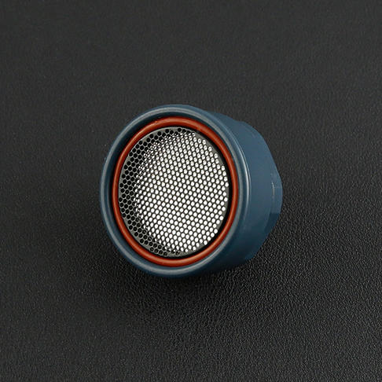

# DFRobot_URMUart
- [中文版](./README_CN.md)

The ultrasonic sensor detects objects from 20cm to 1000cm and provides range information with 1cm resolution. The URM06 has 15 degree beam angle which has excellent receive sensitivity. And it works best when detecting soft targets.




## Product Link (https://www.dfrobot.com/product-1038.html)

    SKU: SEN0149

## Table of Contents

  * [Summary](#summary)
  * [Installation](#installation)
  * [Methods](#methods)
  * [Compatibility](#compatibility)
  * [History](#history)
  * [Credits](#credits)

## Summary

This is a library of range sensors.

## Installation

To use this library, first download the library file, paste it into the \Arduino\libraries directory, then open the examples folder and run the demo in the folder.

## Methods

```C++
  /**
   * @fn begin
   * @brief Init function 
   * @param theBaudrate Serial communication baud rate 
   * @return boolean type, return init status
   * @retval 0 fail
   * @retval -1 success
   */
  boolean begin(unsigned long theBaudrate);

  /**
   * @fn available
   * @brief Check if there is available serial data 
   * @return boolean type, represents data return status 
   * @retval 0 fail
   * @retval -1 success
   */
  boolean available(void);

  /**
   * @fn requestDistance
   * @brief Request distance data from the sensor 
   * @param theAddress Sensor RS485 address 
   * @param theTimeOutDuration  Request timeout  
   * @return boolean type, represents data request return status 
   * @retval 0 request fail
   * @retval -1 request success
   */
  boolean requestDistance(byte theAddress,unsigned long theTimeOutDuration=DefaultTimeOutDuration);

  /**
   * @fn requestTemperature
   * @brief Request temperature data from the sensor 
   * @param theAddress Sensor RS485 address
   * @param theTimeOutDuration  Request timeout
   * @return boolean type, represents data request return status 
   * @retval 0 request fail
   * @retval -1 request success
   */
  boolean requestTemperature(byte theAddress,unsigned long theTimeOutDuration=DefaultTimeOutDuration);

  /**
   * @fn requestMaxDistance
   * @brief Request max detectable distance from sensor 
   * @param theAddress Sensor RS485 address
   * @param theTimeOutDuration  Request timeout  
   * @return boolean type, represent data request return status 
   * @retval 0 request fail
   * @retval -1 request success
   */
  boolean requestMaxDistance(byte theAddress,unsigned long theTimeOutDuration=DefaultTimeOutDuration);
  
  /**
   * @fn setMaxDistance
   * @brief Set sensor max detectable distance  
   * @param theAddress Sensor RS485 address 
   * @param ptheMaxDistance Max distance to be set 
   * @param theTimeOutDuration  Request timeout  
   * @return boolean type, return data set status 
   * @retval 0 set fail
   * @retval -1 set success
   */
  boolean setMaxDistance(byte theAddress,int theMaxDistance,unsigned long theTimeOutDuration=DefaultTimeOutDuration);

  /**
   * @fn setBaudrate
   * @brief Set sensor communication baud rate 
   * @param theAddress Sensor RS485 baud rate
   * @param ptheMaxDistance Baud rate to be set 
   * @param theTimeOutDuration  Request timeout 
   * @return boolean type, return data set status 
   * @retval 0 set fail
   * @retval -1 set success
   */
  boolean setBaudrate(byte theAddress,unsigned long theBaudrate,unsigned long theTimeOutDuration=DefaultTimeOutDuration);

  /**
   * @fn setAddress
   * @brief Set sensor communication address 
   * @param theAddress Sensor RS485 address 
   * @param ptheMaxDistance 待设置的串口通信波特率
   * @param theTimeOutDuration  请求超时 
   * @return boolean类型，表示数据请求返回的状态
   * @retval 0 set fail
   * @retval -1 set success
   */
  boolean setAddress(byte theAddress,unsigned long theTimeOutDuration=DefaultTimeOutDuration);

```

## Compatibility

MCU                | Work Well    | Work Wrong   | Untested    | Remarks
------------------ | :----------: | :----------: | :---------: | -----
Arduino uno        |      √       |              |             | 
Mega2560        |      √       |              |             | 
Leonardo        |      √       |              |             | 
ESP32           |      √       |              |             | 
micro:bit        |      √       |              |             | 
ESP8266         |      √       |              |             |

## History

- 2022/09/6 - Version 1.0.0 released.

## Credits

Written by PengKaixing(kaixing.peng@dfrobot.com), 2022. (Welcome to our [website](https://www.dfrobot.com/))


